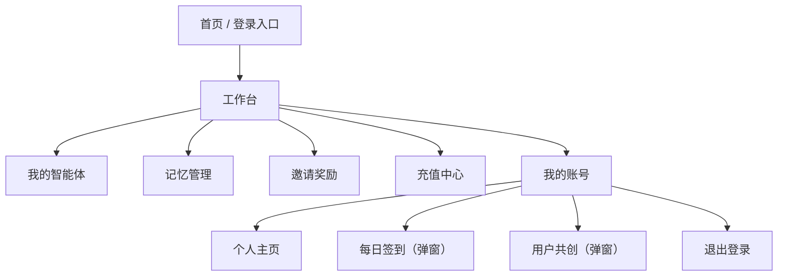
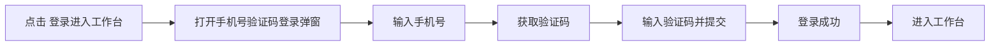
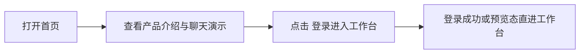
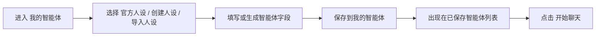
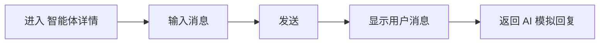
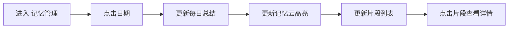
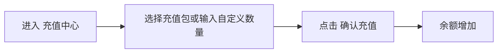
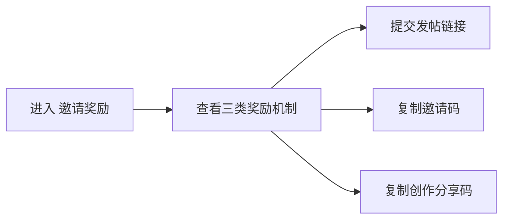
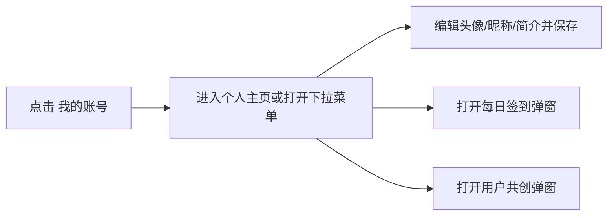

# 心迹档案网站交互逻辑梳理（前端 2.0 预览版）

## 1. 文档说明

本文基于以下内容重新核对：

- 你提供的 5 张当前版页面截图
- 本地目录 `/Users/delores/Documents/心迹档案网站-前端2.0预览`
- 该目录中的 [index.html](/Users/delores/Documents/心迹档案网站-前端2.0预览/index.html) 与 [script.js](/Users/delores/Documents/心迹档案网站-前端2.0预览/script.js)

这份文档以**当前 2.0 预览版**为准，已经覆盖上一版结论。

关键修正：

- 当前版**没有**“社区模板”
- 当前主功能以截图中的工作台结构为准

## 2. 产品结构结论

这版产品已经从“账号工作台 + 社区模板 + 管理审核”转成更聚焦的个人 AI 陪伴工作台，主线围绕 4 个核心模块展开：

- 我的智能体
- 记忆管理
- 邀请奖励
- 充值中心

辅助能力收在“我的账号”入口中：

- 个人主页
- 每日签到
- 用户共创
- 退出登录

## 3. 全站信息架构

## 4. 页面与模块地图

| 模块 | 页面/形态 | 核心目标 |
| --- | --- | --- |
| 首页 | 登录前首页 | 品牌介绍、聊天演示、进入工作台 |
| 我的智能体 | 工作台主页面 | 创建、导入、保存、切换智能体并试聊 |
| 记忆管理 | 工作台页面 | 通过日期、记忆云和片段列表查看被 AI 记住的内容 |
| 邀请奖励 | 工作台页面 | 发帖征集、邀请码、创作分享码 |
| 充值中心 | 工作台页面 | 查看 token 余额、选择充值包、执行充值 |
| 我的账号 | 下拉 + 个人主页页 | 编辑头像、昵称、简介 |
| 每日签到 | 弹窗 | 领取奖励、查看签到记录和活动日公告 |
| 用户共创 | 弹窗 | 提交许愿或建议 |

## 5. 导航逻辑

### 5.1 一级导航

左侧侧边栏固定展示 4 个一级模块：

- 我的智能体
- 记忆管理
- 邀请奖励
- 充值中心

切换逻辑：

- 点击侧边栏按钮后，主内容区切换到对应 section
- 当前选中的导航项高亮
- 不跳转新页面，而是在单页工作台中切换内容

### 5.2 账号入口导航

侧边栏底部“我的账号”是二级入口，点击后展开下拉菜单：

- 个人主页
- 我的智能体
- 充值订阅
- 邀请奖励
- 每日签到
- 用户共创
- 退出登录

说明：

- “每日签到”打开弹窗，不切换主页面
- “用户共创”打开弹窗，不切换主页面
- “退出登录”回到首页

## 6. 登录与进入工作台

### 6.1 首页结构

首页由两部分组成：

- 左侧品牌区：品牌名、Slogan、登录按钮
- 右侧聊天演示区：模拟陪伴聊天，强调产品气质

首页核心目标不是表单填写，而是：

- 建立产品调性
- 通过聊天演示让用户快速理解“AI 陪伴”体验
- 引导用户进入工作台

### 6.2 登录流程

### 6.3 登录后落点

代码里有一个预览态开关：

- `AUTO_PREVIEW_WORKSPACE = true` 时，预览版会自动进入工作台
- 默认展示的是“记忆管理”

因此截图里直接进入工作台是符合当前预览逻辑的。

## 7. 核心业务对象

### 7.1 账号级对象

- 登录态
- 用户手机号
- 个人主页资料
- token 余额
- 签到记录展示

### 7.2 智能体级对象

- 智能体名称
- 语气
- 性格
- 人设
- 基模
- 背景故事
- 试聊上下文

### 7.3 记忆级对象

- 日期
- 每日总结
- 被记住的片段列表
- 当前查看的记忆片段

### 7.4 激励级对象

- 发帖征集提交记录
- 邀请码
- 创作分享码
- 邀请人数
- 智能体使用人数

## 8. 全局状态

当前版主要通过浏览器本地状态保存：

- `xinji_logged_in`：是否已登录
- `auth_token`：登录 token
- `xinji_current_phone`：当前手机号
- `xinji_personal_profile`：个人主页资料
- `xinji_balance`：token 余额
- `xinji_memories`：已保存的智能体
- `xinji_memory_by_date`：记忆管理中的日期与片段数据
- `xinji_campaign_submissions`：发帖征集提交记录

## 9. 核心流程

### 9.1 流程 A：进入产品

### 9.2 流程 B：创建或选择智能体

### 9.3 流程 C：与智能体试聊

### 9.4 流程 D：查看记忆

### 9.5 流程 E：充值

### 9.6 流程 F：邀请奖励

### 9.7 流程 G：个人资料与签到

## 10. 页面级交互说明

### 10.1 首页

#### 页面目标

- 强化品牌记忆
- 展示陪伴式聊天体验
- 作为登录入口

#### 核心模块

- 品牌标题与文案
- 登录按钮
- 微信风格聊天演示

#### 关键交互

- 点击登录按钮，打开手机号验证码登录弹窗
- 首页右侧聊天区主要用于演示，不承担真实聊天功能

### 10.2 我的智能体

#### 页面目标

- 创建和管理用户自己的 AI 智能体
- 为后续聊天和长期陪伴设定人格

#### 页面结构

- 顶部三入口：官方人设 / 创建人设 / 导入人设
- 我的智能体列表
- 智能体详情编辑区
- 实时模拟对话区

#### 三种进入方式

#### 官方人设

- 提供预设人格
- 点击后自动填充字段

当前预设有人设方向：

- 温柔陪伴者
- 清醒引导师
- 灵感共创者

#### 创建人设

- 清空表单
- 由用户从零填写

#### 导入人设

- 清空后填入导入态默认值
- 代表从外部内容导入后继续编辑

#### 编辑字段

- 记忆体命名
- 语气
- 性格
- 人设
- 基模
- 背景故事

#### 保存逻辑

- 点击“保存到我的智能体”后先保存到本地
- 若已接入后端并有 token，再同步到接口
- 保存成功后出现在“我的智能体”列表里

#### 列表逻辑

- 最多保留最近 6 个智能体
- 点击“开始聊天”会重新载入该智能体并进入试聊态

#### 试聊逻辑

- 输入消息后，右侧聊天区展示用户消息
- 若后端可用，则调用 `/chat/simulate`
- 若后端不可用，则返回本地 mock 回复

### 10.3 记忆管理

#### 页面目标

- 把“AI 记住了什么”以可视化方式展示出来

#### 页面结构

- 左侧日期面板
- 中间 3D 心形记忆云
- 右侧记忆片段检查器

#### 关键交互

- 点击日历日期：切换当天记忆
- 点击记忆片段 chip：切换当前详情
- 拖动 3D 爱心：旋转查看
- 点击发光记忆点：切换到对应片段

#### 输出内容

- 当天总结
- 记忆条数
- 当前片段标题与正文

#### 页面价值

这一页的重点不是“编辑记忆”，而是让用户理解：

- AI 已经沉淀了哪些长期信息
- 哪些偏好、风格、需求正在被记住

### 10.4 邀请奖励

#### 页面目标

- 用激励机制推动传播、邀请和创作共建

#### 页面结构

- 发帖征集
- 邀请码
- 创作分享码

#### 发帖征集

- 用户输入帖子链接后提交
- 当前版会记录到本地投稿列表
- 用于统计“已提交 / 待处理”

#### 邀请码

- 一键复制邀请码
- 展示已邀请人数与进度条

#### 创作分享码

- 一键复制分享码
- 展示使用人数与进度条

#### 产品含义

这一页本质上不是“普通活动页”，而是增长页，目标是：

- 拉新
- 内容传播
- 人设共创扩散

### 10.5 充值中心

#### 页面目标

- 展示 token 余额与使用构成
- 提供快捷充值入口

#### 页面结构

- 当前余额
- token 使用占比条
- 充值包按钮组
- 自定义输入
- 通知公告

#### 关键交互

- 点击预设充值包：选中一个固定额度
- 输入自定义数量：取消预设高亮，并按数量计算价格
- 点击确认充值：余额直接增加

#### 当前版特征

- 是前端模拟充值
- 未接入真实支付
- 更像“账户点数管理”而非订单系统

### 10.6 个人主页

#### 页面目标

- 维护用户公开身份与个性信息

#### 页面结构

- 头像上传
- 姓名输入
- 简介输入
- 公开预览卡

#### 关键交互

- 上传头像后先在本地裁切并预览
- 点击保存后写入本地资料
- 若后端可用，同时同步到用户资料接口

### 10.7 每日签到

#### 页面目标

- 提升留存与回访频率

#### 页面形态

- 账号下拉菜单中的弹窗能力

#### 页面内容

- 今日签到状态
- 连续签到数据
- 月度签到日历
- 特殊日期公告入口

#### 关键交互

- 点击带星标的签到日，打开活动公告
- 点击遮罩或关闭按钮关闭弹窗

### 10.8 用户共创

#### 页面目标

- 收集用户许愿与建议

#### 页面形态

- 账号下拉菜单中的弹窗能力

#### 关键交互

- 选择类型：许愿 / 建议
- 输入正文
- 选填联系方式
- 提交后显示“已寄出，心迹档案收到啦”

## 11. 隐藏能力与非主导航内容

代码里还存在一个 `campaignSection`，属于“活动说明 / 发帖征集”的完整说明页，包含：

- 活动介绍
- 奖励公布
- 投稿表单
- 规则
- 参与提醒

但从当前截图和主导航结构看，它**不是当前版的主功能入口**，更像：

- 运营活动落地页
- 或未来从“邀请奖励”进一步展开的二级页

因此在产品主结构里，不建议把它当作现版一级功能。

## 12. 当前版的产品主线

如果把这版产品浓缩成一句话，它的主交互逻辑是：

**用户先进入工作台，创建或选择自己的 AI 智能体，用记忆管理查看长期沉淀，再通过充值和邀请奖励支撑持续使用。**

更具体地说，是这 4 条主线：

1. 登录进入工作台
2. 创建智能体并实时试聊
3. 查看 AI 记住的长期记忆
4. 通过充值与邀请奖励支持持续使用和传播

## 13. 与上一版相比的变化

### 已移除

- 社区模板
- 模板导入社区逻辑

### 已强化

- 智能体创建与试聊
- 记忆可视化
- 邀请奖励与传播机制
- 账号个人主页
- 每日签到与用户共创

## 14. 当前产品风险与待补点

### 14.1 当前是预览逻辑，不等于完整线上闭环

- 充值仍是前端模拟
- 邀请奖励中的发帖提交仍是本地记录
- 智能体保存有本地兜底，后端同步失败不阻断

### 14.2 权限与状态边界还比较轻

- 预览版可自动进入工作台
- 真实登录态与预览态共存
- 不同入口之间的权限规则还未完全显式化

### 14.3 页面级状态还可继续补齐

- 空智能体状态
- 网络失败状态
- 首次进入引导
- 充值成功提示
- 发帖提交成功提示
- 签到成功反馈

## 15. 建议的下一步产物

如果你下一步是要把这版产品真正推进到评审、排期、设计联动或研发落地，建议基于本文继续细化以下 7 份产物。

### 15.1 页面状态表

#### 产物目标

把每个页面或模块在不同状态下该显示什么、用户能做什么、系统怎么反馈，统一梳理清楚。

#### 为什么必须补

当前这版页面结构已经比较完整，但状态定义还比较粗。  
如果不先补状态表，后面很容易出现：

- 设计图只画了理想态，没有空态和失败态
- 开发只实现主流程，没有处理边界情况
- 文案和交互在不同页面不一致

#### 建议覆盖范围

- 首页
- 登录弹窗
- 我的智能体
- 智能体编辑详情
- 实时模拟对话
- 记忆管理
- 充值中心
- 邀请奖励
- 个人主页
- 每日签到弹窗
- 用户共创弹窗

#### 每页建议至少定义 6 类状态

1. 默认态  
页面首次进入时展示什么。

2. 空态  
没有数据时如何提示，例如没有已保存智能体、没有记忆片段、没有投稿记录。

3. 加载态  
正在请求接口、上传头像、发送验证码、生成回复时怎么表现。

4. 成功态  
保存成功、充值成功、提交成功、复制成功后如何反馈。

5. 失败态  
接口失败、验证码失败、头像读取失败、聊天失败时如何提示。

6. 权限/未登录态  
哪些操作可见但不可用，哪些会先拉起登录。

#### 推荐表头

| 页面/模块 | 状态 | 触发条件 | 页面表现 | 用户可操作 | 系统反馈 |
| --- | --- | --- | --- | --- | --- |

#### 当前版最值得先补的状态

- 我的智能体空态
- 记忆管理空态
- 登录验证码发送失败态
- 试聊请求失败态
- 充值成功反馈态
- 发帖提交成功/失败态
- 签到成功态

### 15.2 用户任务流程图

#### 产物目标

把用户为了完成一个任务，从进入页面到完成动作的完整步骤画出来，帮助团队统一理解核心闭环。

#### 为什么必须补

现在这版不是单一页面产品，而是“首页引导 + 工作台多模块 + 弹窗能力”的组合。  
如果没有流程图，团队很容易只盯页面，而忽略任务闭环。

#### 建议优先画 7 条流程

1. 登录进入工作台  
首页进入、验证码登录、进入默认模块。

2. 创建智能体  
进入我的智能体、选择创建方式、填写信息、保存、进入试聊。

3. 使用官方人设  
选择官方人设、自动填充、保存、试聊。

4. 导入人设  
进入导入态、补充字段、保存、试聊。

5. 查看记忆  
进入记忆管理、切换日期、切换记忆片段、查看详情。

6. 充值  
进入充值中心、选择充值包、确认充值、余额更新。

7. 邀请奖励  
进入邀请奖励、提交作品链接、复制邀请码/分享码。

#### 建议表现形式

- Mermaid 流程图
- 泳道图
- Figma 流程箭头图

#### 每条流程建议拆成 5 层

- 用户目标
- 起点页面
- 关键操作
- 系统反馈
- 终点结果

#### 推荐表头

| 流程名称 | 用户目标 | 起点 | 关键步骤 | 成功结果 | 异常分支 |
| --- | --- | --- | --- | --- | --- |

### 15.3 接口映射表

#### 产物目标

把前端页面中的每个关键动作，映射到未来真实后端接口，形成研发可落地的接口清单。

#### 为什么必须补

当前 2.0 预览版很多逻辑是“本地兜底 + 接口尝试”，这非常适合原型，但不适合进入开发排期。  
必须把哪些能力是真接口、哪些是本地假数据，拆清楚。

#### 建议按模块拆分

1. 登录认证
- 发送验证码
- 手机号登录
- 获取用户信息

2. 个人资料
- 获取个人主页资料
- 更新个人主页资料
- 上传头像

3. 智能体
- 获取我的智能体列表
- 创建智能体
- 编辑智能体
- 删除智能体
- 选择当前智能体

4. 聊天模拟
- 调用模拟对话
- 获取试聊历史

5. 记忆管理
- 获取真实长期记忆
- 获取某日期记忆列表
- 获取记忆片段详情

6. 充值
- 获取余额
- 创建充值订单
- 查询订单状态
- 更新余额

7. 邀请奖励
- 提交作品链接
- 获取投稿列表
- 获取邀请码
- 获取创作分享码
- 获取邀请统计

8. 每日签到
- 获取签到状态
- 执行签到
- 获取签到日历
- 获取活动公告

9. 用户共创
- 提交许愿/建议

#### 推荐表头

| 模块 | 前端动作 | 接口名 | Method | 请求参数 | 返回字段 | 是否已有 | 备注 |
| --- | --- | --- | --- | --- | --- | --- | --- |

#### 当前最关键的接口缺口

- 充值没有真实支付闭环
- 邀请奖励没有真实提交流
- 智能体保存缺少完整增删改查
- 记忆管理缺少真实日期级查询结构

### 15.4 页面信息架构图

#### 产物目标

把整个产品的结构关系讲清楚，让团队一眼看懂：

- 一级导航是什么
- 二级入口在哪里
- 弹窗能力挂在哪
- 首页和工作台怎么衔接
- 哪些是主功能，哪些是隐藏能力

#### 为什么必须补

这版已经不是简单的“几个平级页面”，而是：

- 登录前首页
- 登录后工作台
- 工作台内多模块切换
- 账号下拉
- 弹窗功能
- 隐藏运营页

如果没有 IA 图，团队很容易把“邀请奖励”和“活动说明页”混成一个东西。

#### 建议结构层级

1. 登录前
- 首页
- 登录弹窗

2. 登录后工作台
- 我的智能体
- 记忆管理
- 邀请奖励
- 充值中心

3. 账号能力
- 个人主页
- 每日签到
- 用户共创
- 退出登录

4. 隐藏/运营能力
- 活动说明页 `campaignSection`

#### 推荐输出形式

- 站点地图
- 树状图
- Mermaid IA 图

#### 推荐表头

| 层级 | 节点名称 | 入口位置 | 类型 | 是否主路径 | 备注 |
| --- | --- | --- | --- | --- | --- |

### 15.5 组件交互说明表

#### 产物目标

把高复用组件的行为规则拆清楚，方便设计和前端统一实现。

#### 为什么必须补

这版产品大量依赖卡片、按钮、弹窗、chip、复制按钮、列表切换。  
如果不单独定义组件规则，后面会出现：

- 同类卡片点击方式不一致
- 不同页面的“已选中”状态不统一
- 复制、提交、保存按钮反馈不一致

#### 建议优先梳理的组件

1. 侧边栏导航项
2. 账号下拉菜单
3. 智能体入口卡片
4. 已保存智能体卡片
5. 预设人格切换按钮
6. 聊天消息气泡
7. 日期日历按钮
8. 记忆片段 chip
9. 充值包按钮
10. 复制码按钮
11. 弹窗
12. 表单提交按钮

#### 每个组件建议定义的内容

- 组件用途
- 出现位置
- 默认态
- hover/选中/禁用态
- 点击后行为
- 成功反馈
- 失败反馈
- 是否可复用到其他页面

#### 推荐表头

| 组件 | 出现页面 | 触发方式 | 状态 | 交互规则 | 反馈规则 | 备注 |
| --- | --- | --- | --- | --- | --- | --- |

#### 当前最需要先统一的组件

- 智能体卡片
- 充值包按钮
- 邀请码/分享码复制按钮
- 记忆片段切换 chip
- 弹窗关闭逻辑

### 15.6 状态与文案清单

#### 产物目标

统一全站的提示文案、按钮文案、空态文案、错误文案和反馈文案，减少语言风格漂移。

#### 为什么必须补

这类产品很依赖“陪伴感”和“轻柔感”的语言气质。  
如果不做文案清单，最容易出现：

- 首页很柔和，错误提示却很生硬
- 同样是保存成功，不同页面说法不一样
- 增长页和工作台文案语气脱节

#### 建议按 6 类整理

1. 按钮文案
- 登录进入工作台
- 保存到我的智能体
- 确认充值
- 一键复制

2. 成功提示
- 已保存
- 已复制
- 已寄出
- 验证码已发送

3. 错误提示
- 手机号格式错误
- 验证码错误
- 聊天失败
- 保存失败
- 上传失败

4. 空态提示
- 暂无智能体
- 这天还没有记忆
- 还没有填写个人简介

5. 引导文案
- 首页引导
- 表单 placeholder
- 聊天输入引导

6. 活动/奖励说明文案
- 发帖规则
- 邀请奖励规则
- 分享码奖励规则

#### 推荐表头

| 页面/模块 | 文案位置 | 文案类型 | 当前文案 | 建议语气 | 是否需统一 |
| --- | --- | --- | --- | --- | --- |

#### 这一版特别要注意的文案统一点

- “智能体 / 人设 / 记忆体”三者命名要不要统一
- “登录 / 注册”是否继续合并表达
- “tokens / 对话轮数 / 余额”是否需要统一计量语言

### 15.7 权限与入口边界表

#### 产物目标

明确每个功能的可见范围、可操作范围和触发前提，避免后续出现“能看到但不能用”或“预览态能力误当正式能力”。

#### 为什么必须补

当前代码里同时存在：

- 登录前首页
- 登录后工作台
- 预览态自动进入工作台
- 本地数据兜底
- 接口接通后的在线态

这几层状态如果不拆清楚，后面产品和研发会反复对不齐。

#### 建议至少梳理 4 类边界

1. 登录边界
- 首页是否允许直接看工作台
- 哪些操作必须登录后才能执行

2. 预览态边界
- 哪些能力是为了 demo 自动开放的
- 哪些能力上线后不能这么做

3. 数据来源边界
- 哪些是本地 localStorage
- 哪些要走真实后端
- 哪些失败后可以本地兜底

4. 运营入口边界
- 邀请奖励是常驻功能还是活动期功能
- `campaignSection` 是否长期保留
- 每日签到和公告是常驻还是可按活动期开关

#### 推荐表头

| 功能 | 入口位置 | 是否默认可见 | 是否需登录 | 数据来源 | 预览态特殊处理 | 上线注意点 |
| --- | --- | --- | --- | --- | --- | --- |

#### 当前最需要明确的边界

- 首页登录前是否允许直接预览工作台
- 智能体保存失败后是否一定允许本地保存
- 记忆管理在无真实数据时是否显示 demo 内容
- 邀请奖励是否为常驻一级导航
- 活动说明页是否进入正式 IA
