# 心迹档案用户任务流程图（前端 2.0 预览版）

## 1. 登录进入工作台

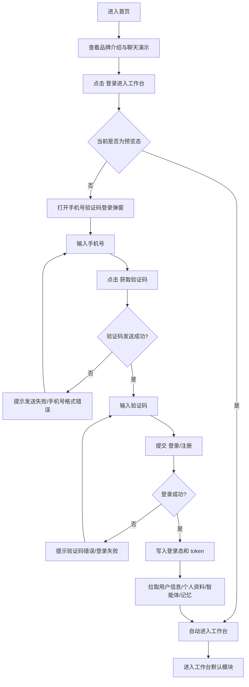

## 2. 创建智能体

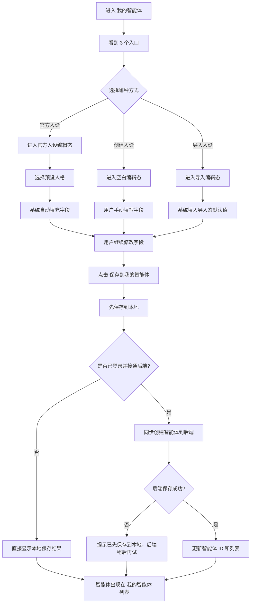

## 3. 使用官方人设

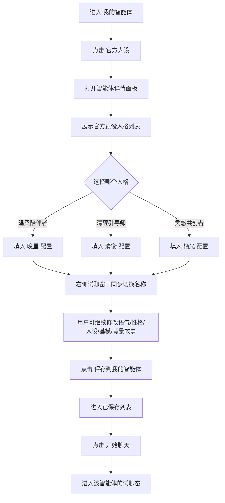

## 4. 导入人设

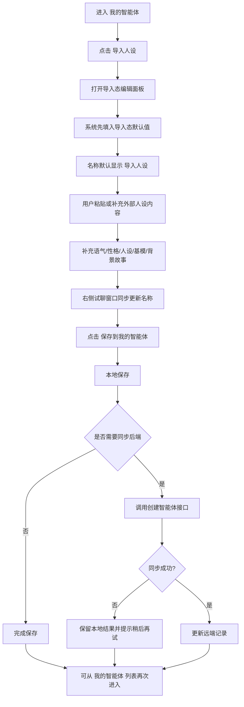

## 5. 智能体试聊

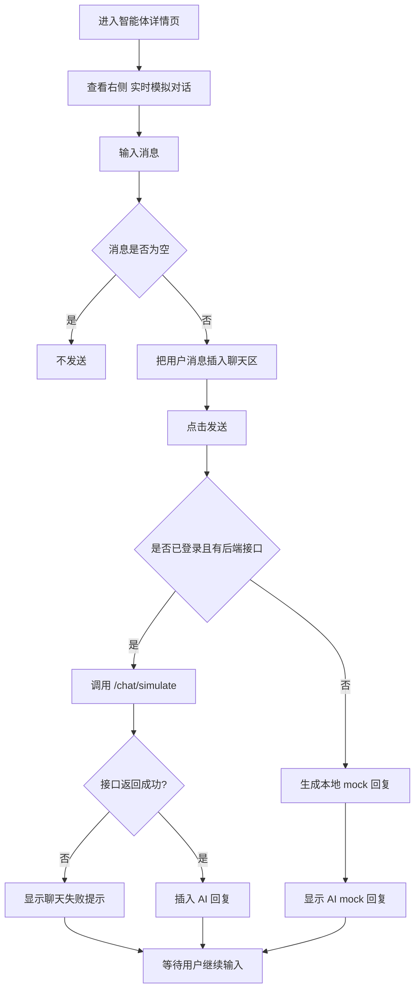

## 6. 记忆管理

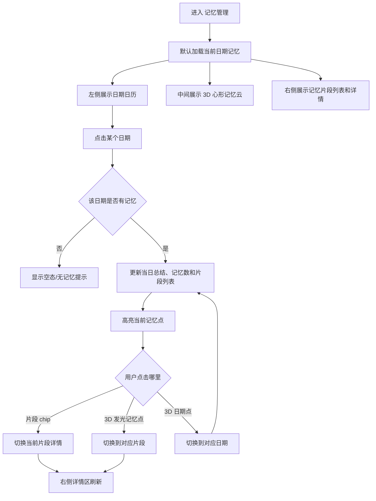

## 7. 充值中心

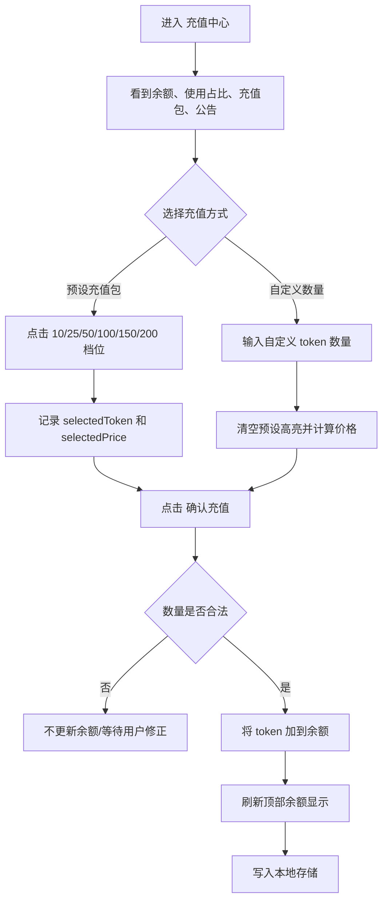

## 8. 邀请奖励

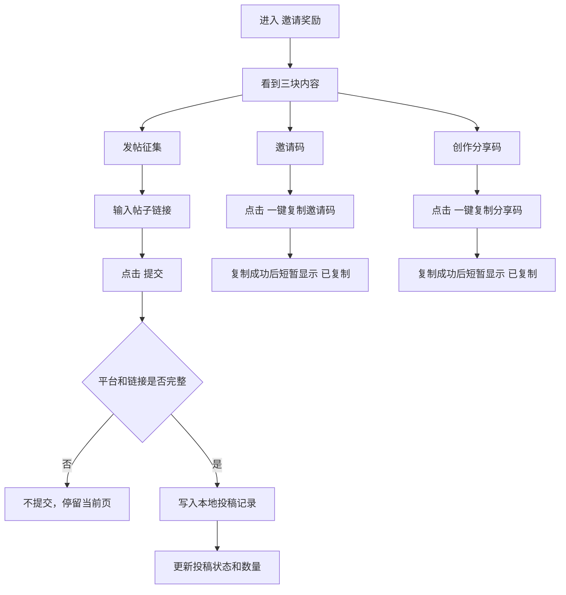

## 9. 个人主页

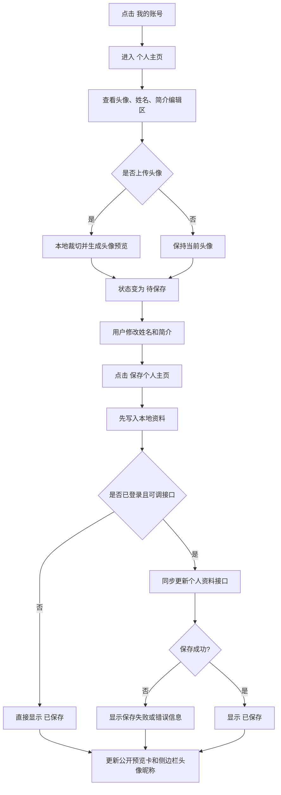

## 10. 每日签到

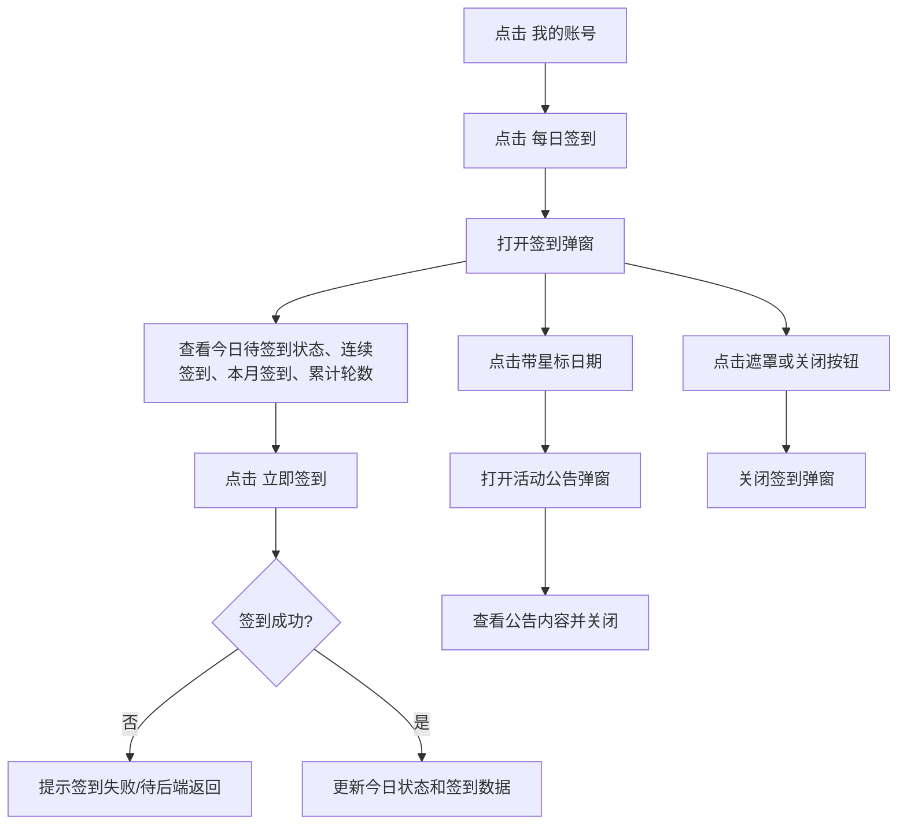

## 11. 用户共创

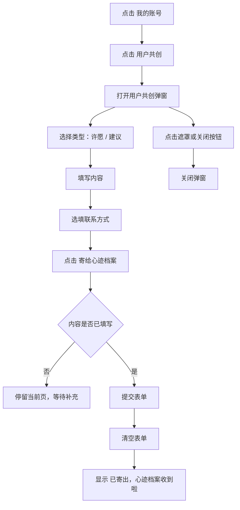

## 12. 退出登录

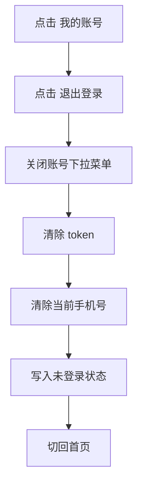

