# 心迹档案网站功能与交互逻辑说明

更新日期：2026-06-04

适用范围：当前目录 `/Users/delores/Documents/心迹档案网站` 内的 Next.js 前端实现

## 1. 文档目的

本文用于梳理当前网站的：

- 功能结构
- 页面与模块职责
- 关键交互流程
- 状态与数据流
- 建议埋点方案
- 异常交互与容错场景

说明基于当前代码实现，而不是历史原型或旧版流程文档，因此内容以“现状”优先。

## 2. 产品定位与当前范围

当前站点是一个“长期陪伴型 AI 平台 MVP 前端工作台”，核心围绕以下能力展开：

- 账号登录与演示注册/找回
- 用户主页与记忆体切换
- 提示词调试
- 记忆查看
- 收件箱通知查看
- 充值与激励活动
- 分享落地页体验
- 客服对话页

当前实现特点：

- 以前端本地 mock 数据和 `localStorage` 持久化为主
- 未接入真实后端接口
- 多数动作会直接更新本地状态，不存在真实服务端校验
- 已具备错误页与 404 页的基本兜底

## 3. 站点信息架构

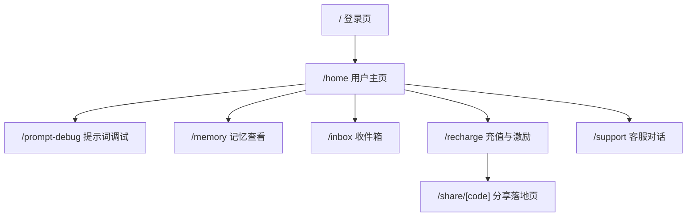

## 4. 页面地图与职责

| 路径 | 页面名称 | 页面职责 | 主要交互 |
| --- | --- | --- | --- |
| `/` | 登录页 | 登录、注册、找回密码入口 | 登录提交、打开/关闭弹窗、注册回填、重置回填 |
| `/home` | 用户主页 | 展示账号状态、快捷入口、记忆体切换 | 编辑昵称、切换记忆体、跳转各模块 |
| `/prompt-debug` | 提示词调试 | 编辑当前记忆体 Prompt 字段并做 mock 对话 | 切换记忆体、改字段、保存、发测试消息、导入模板 |
| `/memory` | 记忆查看 | 以日历查看当前记忆体的记忆条目 | 切月、选日期、查看空态/有数据态 |
| `/inbox` | 收件箱 | 查看系统通知、邀请码、优惠券、审核消息 | 选中消息、查看详情 |
| `/recharge` | 充值 | 余额查看、充值、激励活动查看、发帖链接提交、复制分享链接 | 选套餐、自定义金额、打开支付弹窗、确认付款、复制邀请码/分享链接 |
| `/support` | 联系客服 | 与“小U”进行 mock 客服对话 | 发送问题 |
| `/share/[code]` | 分享落地页 | 记录分享访问、体验启动、有效使用 | 进入即记录 visit、点击开始体验、发送消息累计有效使用 |
| `app/error.tsx` | 全局错误页 | 页面运行时错误恢复 | 点击重新加载 |
| `app/not-found.tsx` | 404 页 | 无效路径兜底 | 返回首页 |

## 5. 全局状态与数据对象

当前全站状态由 `AppProvider` 统一管理，并通过 `localStorage` 写入 `companion-platform-state-v1`。

### 5.1 全局状态字段

- `user`
  - 用户 ID
  - 昵称
  - 头像字母
  - 会员等级
  - 余额
  - 邮箱/账号
- `isAuthenticated`
  - 是否登录
- `currentMemoryId`
  - 当前选中的记忆体
- `templates`
  - 模板库数据
- `promptDrafts`
  - 各记忆体对应的提示词草稿
- `reviewSubmissions`
  - 发帖征集提交记录
- `shareCampaigns`
  - 分享活动统计数据

### 5.2 核心业务对象

#### 用户

- 基础身份信息
- 会员状态
- 余额
- 昵称

#### 记忆体

- 名称
- 描述
- 最近更新时间
- 语气标签

#### Prompt 草稿

- 记忆体命名
- 语气
- 性格
- 人设
- 基模
- 背景故事

#### 投稿审核记录

- 类型
- 标题
- 链接
- 提交时间
- 审核状态

#### 分享活动

- 分享码
- 对应记忆体
- 浏览量 visits
- 启动体验人数 activatedVisitorIds
- 有效使用人数 effectiveVisitorIds

## 6. 导航与进入逻辑

### 6.1 桌面端导航

左侧固定侧边栏包含：

- 用户主页
- 提示词调试
- 记忆查看
- 收件箱
- 充值

### 6.2 移动端导航

移动端将主导航折叠到顶部横向滚动标签中，仍保留相同入口。

### 6.3 头像菜单

顶部右侧头像按钮打开下拉菜单：

- 联系客服
- 退出登录

交互说明：

- 点击头像可展开/收起菜单
- 点击菜单外区域自动关闭
- 点击“联系客服”跳转 `/support`
- 点击“退出登录”后清除登录态并回到 `/`

### 6.4 登录态说明

当前实现中：

- 登录页提交账号密码后直接调用本地 `login(account)`
- 未进行真实鉴权
- 登录成功后跳转 `/home`
- 即使未登录，代码中没有对工作台页做强鉴权拦截

这意味着当前更偏演示环境，而不是生产态鉴权流程。

## 7. 关键交互流程

## 7.1 登录、注册、找回密码

### 主流程

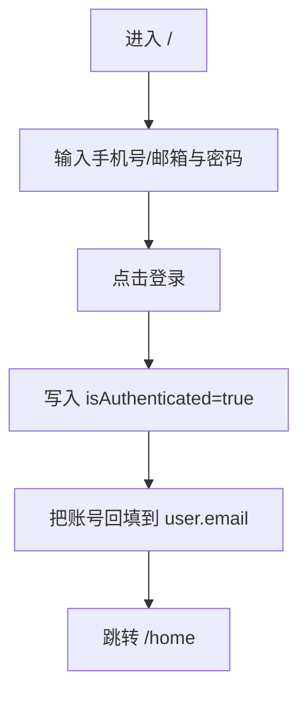

### 注册流程

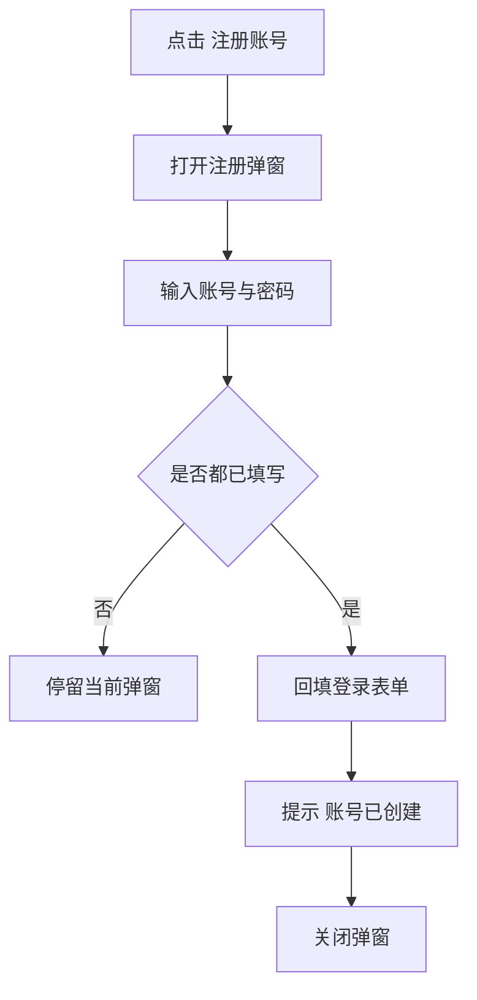

### 找回密码流程

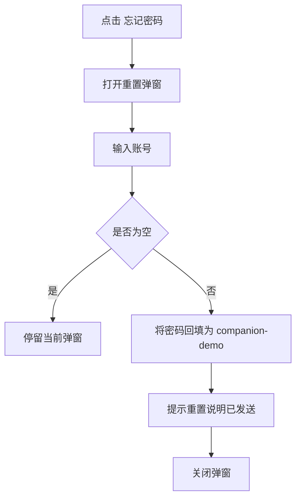

### 现状特点

- 没有验证码流程
- 没有账号格式校验
- 没有登录失败分支
- 注册与找回都是“回填型演示交互”

## 7.2 用户主页与记忆体切换

### 主流程

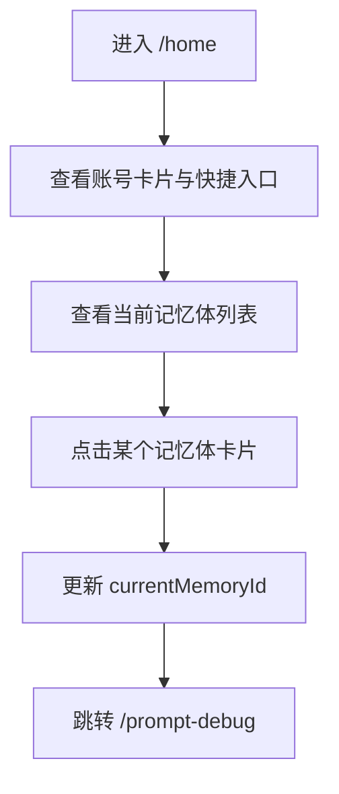

### 昵称编辑流程

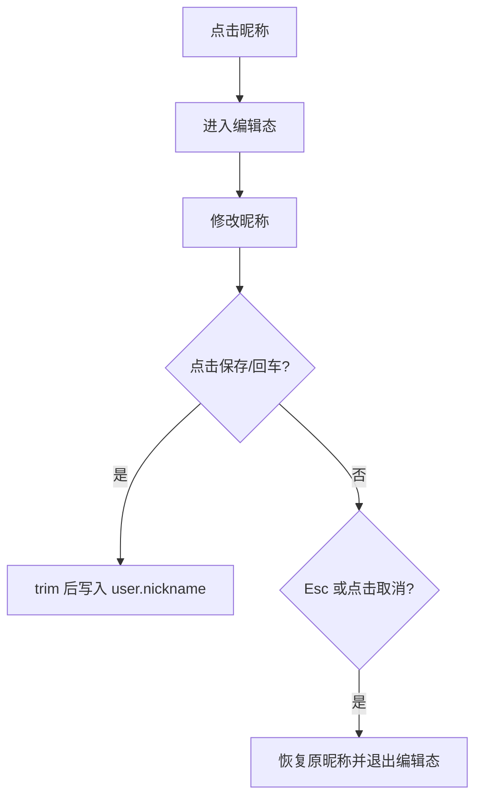

### 说明

- 用户主页是全站的业务中枢
- 记忆体切换会影响提示词调试和记忆查看两个页面
- 页面展示分享活动“自动统计中”，但主页暂未展示具体 visits / activation / effective 的数值明细

## 7.3 提示词调试

### 页面职责

用于编辑当前记忆体的 Prompt 草稿，并通过本地 mock 对话验证人设口吻。

### 主流程

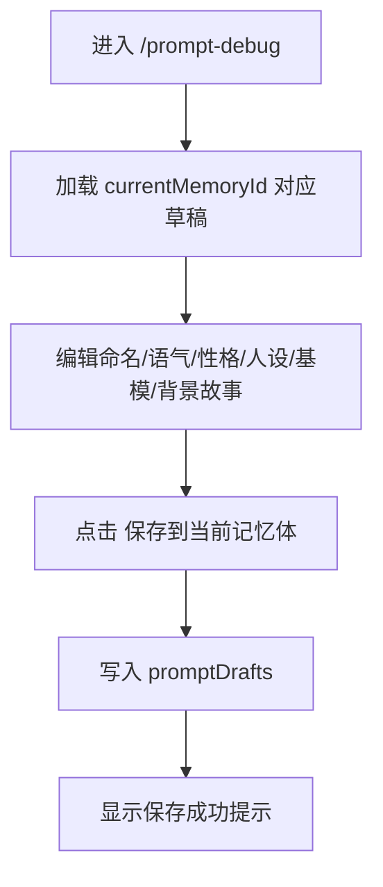

### 调试聊天流程

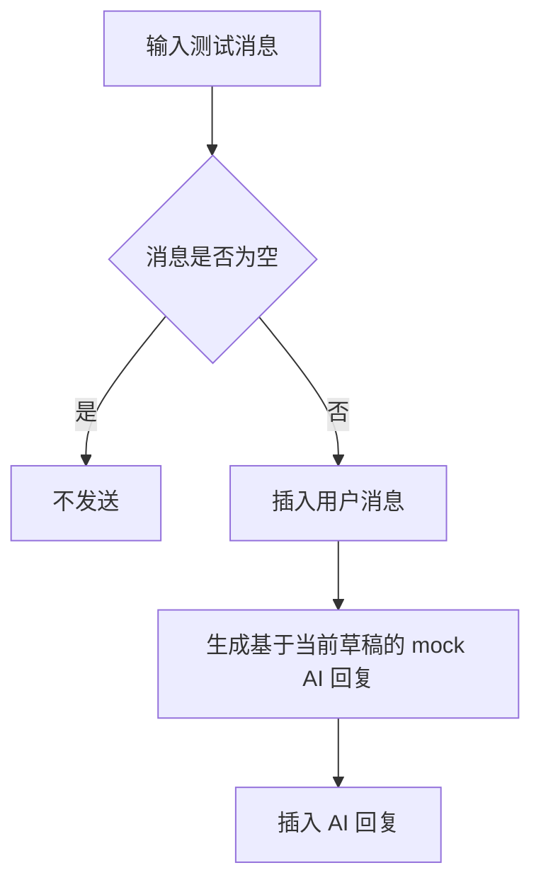

### 模板导入流程

页面支持通过 URL 参数 `?template=模板ID` 导入：

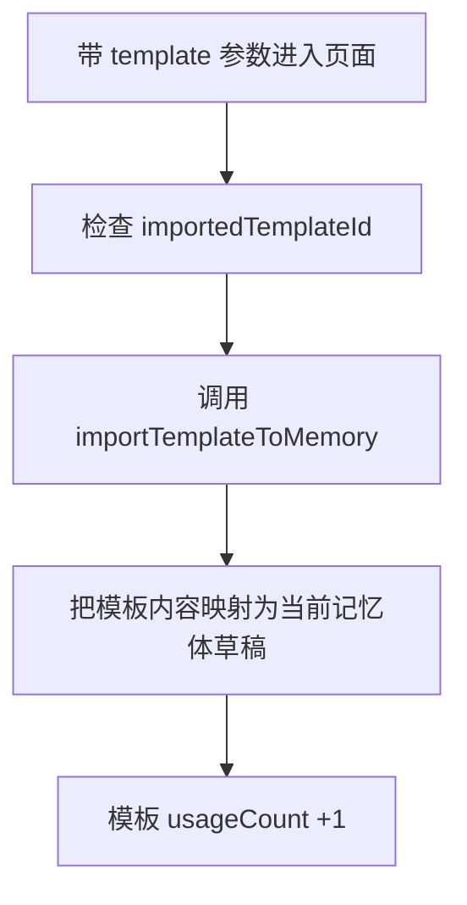

### 交互细节

- 切换记忆体时，编辑区与聊天初始文案会同步刷新
- 保存成功仅体现在本地提示文案，不含服务端状态
- 聊天返回内容来自字符串拼接，不是真实模型响应

## 7.4 记忆查看

### 页面职责

按当前记忆体查看记忆条目，采用“月历 + 当日记忆文字条”的浏览模式。

### 主流程

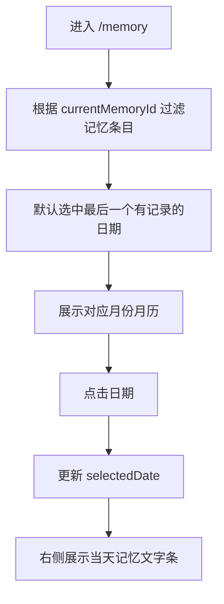

### 切月流程

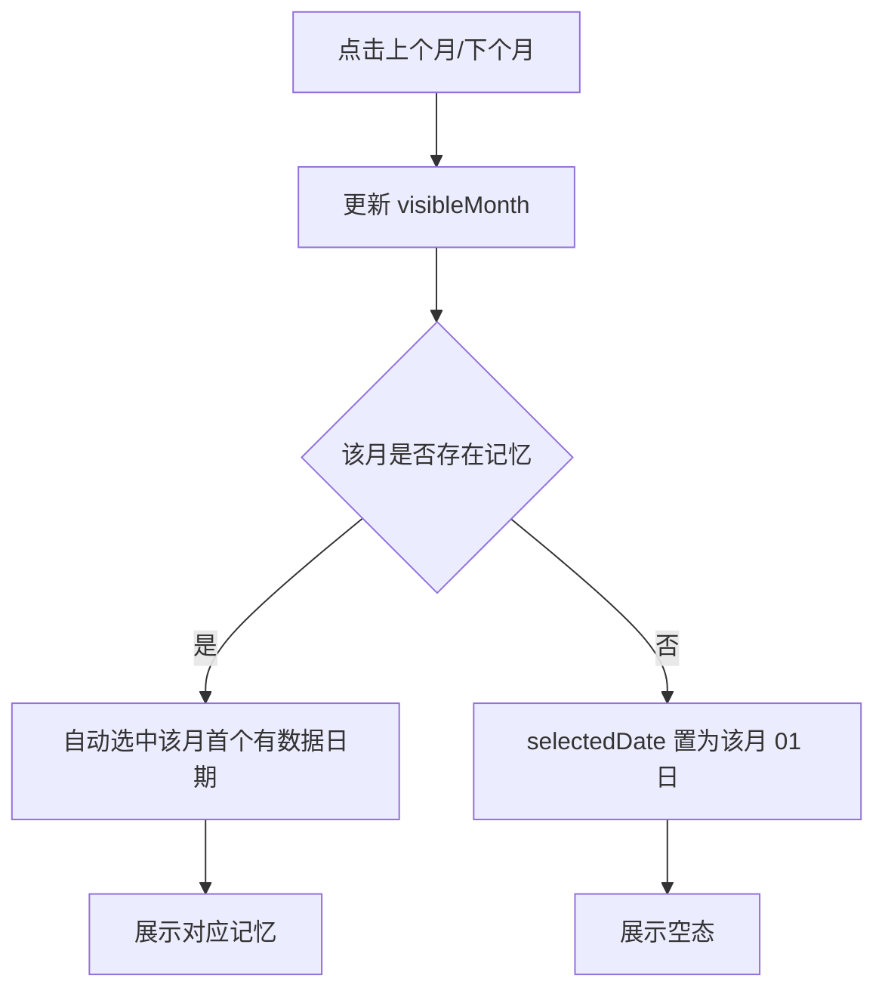

### 现状说明

- 页面中定义了 `buildSummary`，但当前 UI 未实际展示“当天总结”
- 当前只展示记忆条 `summary`，未展示标题、情绪标签、连接关系
- 点击无数据日期也是允许的，右侧进入空态

## 7.5 收件箱

### 页面职责

用于集中承载：

- 系统通知
- 邀请码消息
- 优惠券消息
- 投稿审核状态消息

### 主流程

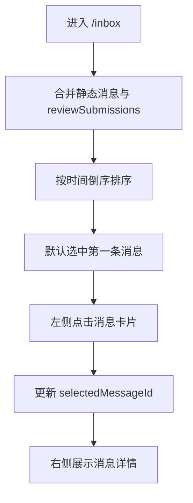

### 说明

- 当前“未读”只是展示字段，不会在点击后自动转已读
- 投稿审核消息由本地投稿记录动态生成
- 暂无筛选、搜索、批量已读等能力

## 7.6 充值与激励活动

### 页面职责

这一页同时承担两类功能：

- 充值
- 激励活动与链接提交/复制

### 充值主流程

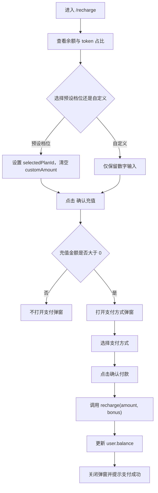

### 激励活动流程

页面内有三类公告卡片：

- 发帖征集
- 邀请码
- 创作分享码

#### 发帖征集

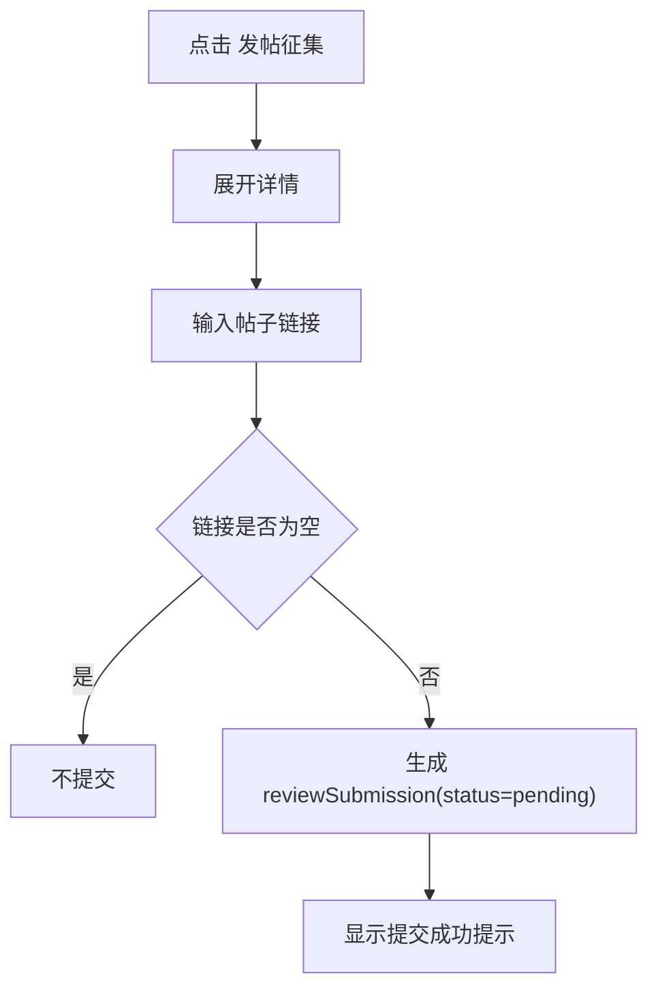

#### 邀请码

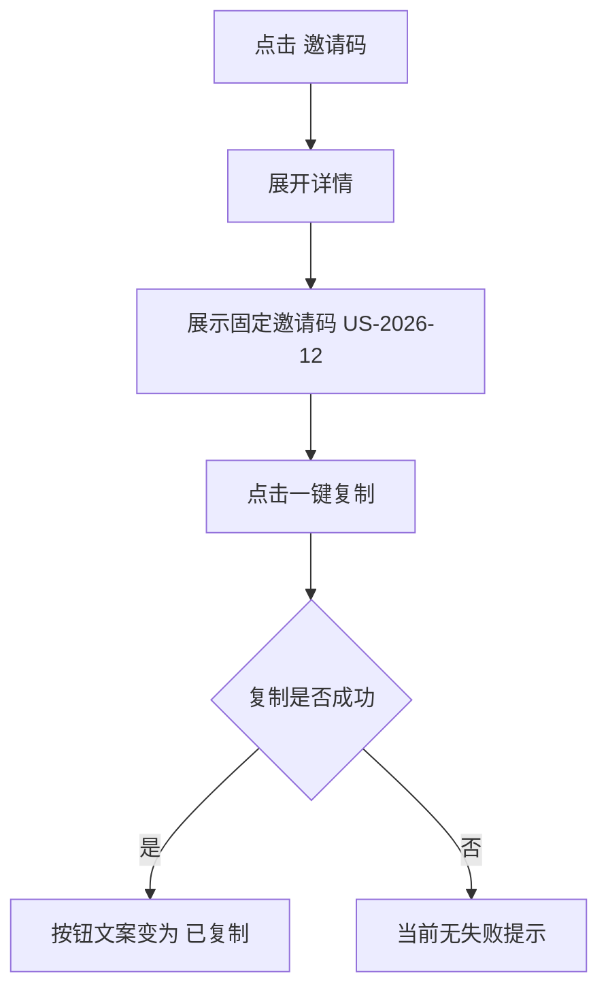

#### 创作分享码

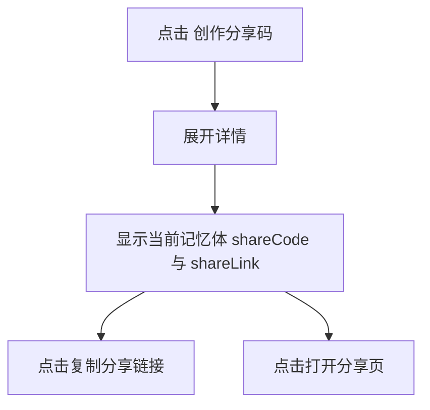

### 充值页现状说明

- 余额显示单位是 token，但底层金额逻辑本质上直接把数字加到 `user.balance`
- 自定义充值不含赠送奖励
- 支付方式选择只影响前端选中态，不影响结算逻辑
- 支付成功后没有订单号、流水、重试、取消后恢复提示

## 7.7 分享落地页

### 页面职责

用于承接创作分享码外链访问，并记录三层转化：

- 浏览 visit
- 启动体验 activation
- 有效使用 effective use

### 主流程

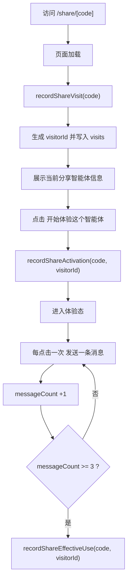

### 统计口径

- `visit`：访问落地页即计数
- `activation`：点击开始体验计数，且同一 visitorId 去重
- `effective use`：发送满 3 条消息后计数，且同一 visitorId 去重

### 现状风险

- `visitorId` 仅在当前会话内由前端生成，没有跨设备/跨刷新识别
- 访问页刷新会重新生成新的 visitorId，可能放大 visit
- 无防刷策略
- 无无效分享码提示页，找不到 code 时会回退显示默认记忆体信息

## 7.8 客服对话页

### 主流程

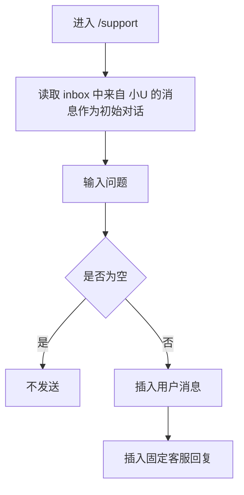

### 说明

- 当前是 mock 客服会话
- 不接收真实人工客服状态
- 没有会话分配、已解决状态、附件上传等能力

## 8. 埋点设计建议

当前代码里没有接入真实埋点 SDK。下面给出一套适合当前 MVP 的埋点方案，方便后续接入神策、GrowingIO、GA4、Mixpanel 或自研埋点。

## 8.1 埋点原则

- 页面曝光和关键动作都要有
- 核心转化链路要能串起来
- 错误与失败分支必须单独记录
- 埋点字段尽量复用全局上下文

建议所有事件默认带上：

- `page_path`
- `page_name`
- `user_id`
- `is_authenticated`
- `current_memory_id`
- `current_memory_name`
- `client_time`

## 8.2 页面曝光事件

| 事件名 | 触发时机 | 关键属性 |
| --- | --- | --- |
| `page_view_login` | 打开 `/` | 来源、是否已有本地登录态 |
| `page_view_home` | 打开 `/home` | 当前余额、当前记忆体 |
| `page_view_prompt_debug` | 打开 `/prompt-debug` | 当前记忆体、是否带 template 参数 |
| `page_view_memory` | 打开 `/memory` | 当前记忆体、默认日期 |
| `page_view_inbox` | 打开 `/inbox` | 未读数、消息总数 |
| `page_view_recharge` | 打开 `/recharge` | 当前余额、默认套餐 |
| `page_view_support` | 打开 `/support` | 初始消息数 |
| `page_view_share` | 打开 `/share/[code]` | share_code、memory_id、是否命中活动 |
| `page_view_not_found` | 打开 404 | 来源路径 |
| `page_view_error` | 进入全局错误页 | error_digest、来源路径 |

## 8.3 登录与账号相关事件

| 事件名 | 触发时机 | 关键属性 |
| --- | --- | --- |
| `login_submit` | 点击登录 | account_type、account_masked |
| `login_success` | 登录成功 | account_masked |
| `register_modal_open` | 打开注册弹窗 | 来源页 |
| `register_submit` | 提交注册 | account_type |
| `register_prefill_success` | 注册成功并回填 | account_type |
| `reset_modal_open` | 打开重置弹窗 | 来源页 |
| `reset_submit` | 提交找回密码 | account_type |
| `nickname_edit_start` | 点击昵称进入编辑态 | old_nickname |
| `nickname_edit_save` | 保存昵称 | old_nickname、new_nickname_length |
| `logout_click` | 点击退出登录 | 来源页 |
| `logout_success` | 跳回首页后 | user_id |

## 8.4 记忆体与提示词调试事件

| 事件名 | 触发时机 | 关键属性 |
| --- | --- | --- |
| `memory_switch` | 切换记忆体 | from_memory_id、to_memory_id、entry_page |
| `prompt_field_edit` | 修改任一字段时 | field_name、content_length |
| `prompt_save_click` | 点击保存 | memory_id |
| `prompt_save_success` | 保存完成 | memory_id、field_completion_rate |
| `prompt_template_import` | 通过 URL 参数导入模板 | template_id、memory_id |
| `prompt_chat_send` | 发送测试消息 | message_length |
| `prompt_chat_reply_rendered` | mock 回复渲染完成 | memory_id |

## 8.5 记忆查看事件

| 事件名 | 触发时机 | 关键属性 |
| --- | --- | --- |
| `memory_calendar_month_switch` | 切月 | from_month、to_month |
| `memory_date_select` | 选中日期 | selected_date、has_items、item_count |
| `memory_empty_state_view` | 查看空态日期 | selected_date |

## 8.6 收件箱事件

| 事件名 | 触发时机 | 关键属性 |
| --- | --- | --- |
| `inbox_message_select` | 点击消息卡片 | message_id、category、is_unread |
| `inbox_message_exposure` | 默认或切换后展示详情 | message_id、category |

## 8.7 充值与激励事件

| 事件名 | 触发时机 | 关键属性 |
| --- | --- | --- |
| `recharge_plan_select` | 点击预设套餐 | plan_id、amount、bonus |
| `recharge_custom_input` | 输入自定义金额 | amount |
| `recharge_submit_click` | 点击确认充值 | amount、bonus、source_type |
| `recharge_payment_modal_open` | 打开支付弹窗 | amount、bonus |
| `recharge_payment_method_select` | 切换支付方式 | method |
| `recharge_payment_confirm` | 点击确认付款 | method、amount、bonus |
| `recharge_payment_success` | 余额更新成功 | balance_before、balance_after |
| `notice_card_open` | 打开公告详情 | notice_type |
| `post_link_submit` | 提交帖子链接 | link_domain、link_length |
| `post_link_submit_success` | 提交成功 | submission_id |
| `invite_code_copy` | 复制邀请码 | code |
| `share_link_copy` | 复制分享链接 | share_code、memory_id |
| `share_link_open` | 点击打开分享页 | share_code、memory_id |

## 8.8 分享链路事件

| 事件名 | 触发时机 | 关键属性 |
| --- | --- | --- |
| `share_visit_recorded` | 进入分享页成功计数 | share_code、memory_id、visitor_id |
| `share_activation` | 点击开始体验 | share_code、visitor_id |
| `share_message_send` | 点击发送一条消息 | share_code、visitor_id、message_count |
| `share_effective_use` | 满 3 条消息 | share_code、visitor_id |

## 8.9 客服事件

| 事件名 | 触发时机 | 关键属性 |
| --- | --- | --- |
| `support_message_send` | 发送客服消息 | message_length |
| `support_auto_reply_rendered` | 自动回复生成 | reply_type |

## 8.10 异常与错误事件

| 事件名 | 触发时机 | 关键属性 |
| --- | --- | --- |
| `clipboard_copy_failed` | 复制失败 | target_type、error_message |
| `storage_hydration_failed` | localStorage 解析失败 | storage_key |
| `global_error_rendered` | 进入全局错误页 | error_digest、message |
| `invalid_share_code_view` | 分享码无匹配时 | share_code |
| `empty_submit_blocked` | 表单为空被阻止提交 | form_name、field_name |

## 9. 异常交互与边界场景

## 9.1 已存在的异常处理

- `localStorage` 解析异常时会忽略坏数据并回退默认状态
- 全局错误页支持点击“重新加载”
- 404 页面支持回首页
- 空输入场景多数会直接 return，不继续执行

## 9.2 当前已知异常/风险点

### 登录与鉴权

- 未登录也可以通过直接输入 URL 进入工作台页面
- 没有密码错误、账号不存在、账号禁用等失败反馈

### 注册与找回密码

- 缺少手机号/邮箱格式校验
- 缺少密码强度校验
- 重置密码并不发送真实通知

### 用户主页

- 昵称保存为空时仅静默失败，没有显式提示

### 提示词调试

- 未保存离开无拦截
- 没有脏数据提示
- 字段超长没有限制

### 记忆查看

- 无数据月份会生成 `YYYY-MM-01` 的伪选中日期
- 当前用户可能误以为该日应有数据，需增加“当前月份暂无记忆”文案

### 收件箱

- 消息点击后不自动标记已读
- 未读数量不会因查看详情而减少

### 充值

- 自定义金额允许输入极大值，缺少上限与风控
- 支付取消后无状态提示
- 支付成功没有防重复提交
- 金额与 token 概念当前混用

### 分享

- 无效分享码不会报错，只会回退到默认记忆体，容易造成数据误记
- 分享页刷新可能重复累计 visits
- “发送一条消息”按钮可无限点击，易造成有效使用被模拟刷量

### 客服

- 无网络失败、发送失败、排队中等状态
- 无人工接入、会话关闭、满意度评价

## 9.3 建议补强的异常反馈

- 登录失败 toast
- 表单校验错误文案
- 复制失败 toast
- 支付中、支付取消、支付失败态
- 无效分享码独立空态页
- 提示词未保存离开确认弹窗
- 投稿链接格式错误提示

## 10. 推荐的优化优先级

### P0

- 给工作台页面加登录态拦截
- 给分享页增加无效分享码校验
- 给充值加金额上下限和重复点击保护
- 给复制失败、保存失败补可见反馈

### P1

- 接入真实埋点
- 收件箱增加已读逻辑
- 提示词调试增加未保存离开提示
- 记忆查看补“按月无数据”提示

### P2

- 支持真实客服工单或 IM
- 支持模板管理完整流程
- 支持更细的分享转化面板

## 11. 结论

当前站点已经形成一条可演示的完整主链路：

- 登录进入工作台
- 选择记忆体
- 调试 Prompt
- 查看记忆
- 充值与参加激励
- 通过分享链接带来外部体验

但它本质上仍是“前端驱动的 MVP 演示版”。若要进入可运营阶段，最先要补的是：

- 鉴权与权限
- 埋点闭环
- 异常提示
- 分享防刷与无效码校验
- 充值订单化

以上梳理可直接作为产品交互说明、研发联调清单和埋点设计初稿继续往下拆。
